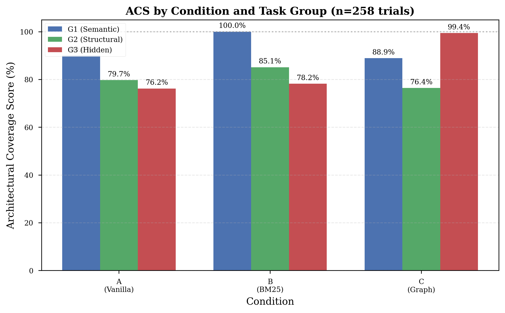

# CodeCompass: Graph-Based Navigation for Agentic Coding

> *"The Navigation Paradox in Large-Context Agentic Coding"*

[](https://arxiv.org)
[](LICENSE)

Empirical evaluation demonstrating that graph-based structural navigation provides a **23.2 percentage-point improvement** on hidden-dependency tasks compared to vanilla Claude Code and BM25 retrieval.

📄 **[Read the full paper](paper/draft_v1.md)** | 📊 **[View results](FINAL_RESULTS.md)** | 📝 **[Medium article](https://medium.com/@tpaip607/codecompass)**

---

## Key Findings

From 258 controlled trials across 30 benchmark tasks:

1. **BM25 is optimal for semantic tasks** (G1: **100% ACS**, zero variance)
2. **Graph navigation dominates on hidden dependencies** (G3: **99.4% ACS** vs 76.2% baseline — **+23.2pp**, t=5.23, p<0.001)
3. **Tool effectiveness ≠ tool adoption**: When used, graph achieves **99.5% ACS**; when ignored, **80.2% ACS** (identical to baseline)
4. **G2 regression explained by zero adoption**: 0% of G2 trials (0/30) used the graph tool, resulting in prompt overhead without navigational benefit
5. **Navigation quality correlates with implementation**: Trials achieving complete coverage (ACS ≥ 1.0) edited **63% of required files** vs **40% for incomplete trials** (ECR metric)
6. **Prompt engineering matters**: Checklist-at-END formatting achieved **100% tool adoption** on G3 tasks (up from 85.7%)


*Architectural Coverage Score across experimental conditions. Graph navigation (C) achieves 99.4% on hidden-dependency tasks (G3).*

---

## The Navigation Paradox

**Problem:** As LLM context windows expand to 1M+ tokens, the assumption is that "the whole codebase fits" solves file discovery. We show this is false.

**Reality:** Files are missed not due to context limits but **navigational salience**. Architecturally critical files with zero semantic overlap to the task (e.g., `database.py` for a task about "add logger parameter to BaseRepository") are invisible to retrieval — keyword or embedding-based.

**Solution:** Expose the structural dependency graph (IMPORTS, INHERITS, INSTANTIATES edges) as a navigational tool via MCP. One graph call surfaces the hidden file as the first result.

---

## Experimental Design

### Benchmark

30 tasks on [fastapi-realworld-example-app](https://github.com/nsidnev/fastapi-realworld-example-app), partitioned by dependency discoverability:

| Group | Description | Count | Example |
|-------|-------------|-------|---------|
| **G1 — Semantic** | Keyword-findable files | 10 | "Change error message 'incorrect email' to 'invalid credentials'" |
| **G2 — Structural** | Requires tracing import chains | 10 | "Extract RWAPIKeyHeader to app/api/security.py" |
| **G3 — Hidden** | Only discoverable via graph | 10 | "Add logger parameter to BaseRepository.__init__" |

### Conditions

| Condition | Description | MCP | BM25 |
|-----------|-------------|-----|------|
| **A — Vanilla** | Unaugmented Claude Code (claude-sonnet-4-5) | ✗ | ✗ |
| **B — BM25** | BM25 file rankings prepended to prompt | ✗ | ✓ |
| **C — Graph** | CodeCompass MCP server exposing dependency graph | ✓ | ✗ |

Each task run 3 times per condition = 270 planned trials (258 completed, 95.6%).

### Metrics

- **ACS (Architectural Coverage Score):** `|files_accessed ∩ required_files| / |required_files|`
- **ECR (Edit Completeness Rate):** `|files_edited ∩ required_files| / |required_files|` — fraction of required files actually edited
- **RER (Read-to-Edit Ratio):** `|files_read| / |files_edited|` — exploration efficiency (lower is better)
- **FCTC (First Correct Tool Call):** Steps to first required file (lower is better)
- **MCP Adoption:** Percentage of trials invoking graph tool

---

## Results Summary

| Condition | G1 Semantic | G2 Structural | G3 Hidden | Overall |
|-----------|-------------|---------------|-----------|---------|
| A — Vanilla | 90.0% | 79.7% | 76.2% | **82.0%** |
| B — BM25 | **100.0%** | **85.1%** | 78.2% | **87.1%** |
| C — Graph | 88.9% | 76.4% | **99.4%** | **88.3%** |

### MCP Tool Adoption (Condition C)

| Group | Adoption Rate | Mean ACS (when used) |
|-------|---------------|---------------------|
| G1 (Semantic) | 22.2% | — |
| G2 (Structural) | **0.0%** | — |
| G3 (Hidden) | **100%** | **99.5%** |

**Critical finding:** With improved prompt engineering (checklist-at-END), G3 adoption reached 100% (31/31 trials). When the graph tool is used, mean ACS is 99.5%; when skipped, 80.2% (identical to Vanilla).


*Impact of MCP tool usage: +19.2% improvement when adopted.*

---

## Installation

### Prerequisites

- Python 3.11+
- Docker (for Neo4j)
- Claude Code CLI (`brew install anthropics/claude/claude`)
- Anthropic API key with sufficient credits

### Setup

```bash
# Clone repository
git clone https://github.com/tpaip607/research-codecompass.git
cd research-codecompass

# Create virtual environment
python3.11 -m venv .venv
source .venv/bin/activate

# Install dependencies
pip install -r requirements.txt

# Copy environment template
cp .env.example .env
# Edit .env and add your ANTHROPIC_API_KEY
```

### Neo4j Setup

CodeCompass uses Neo4j to store and query the dependency graph. Start Neo4j using Docker Compose:

```bash
# Start Neo4j in the background
docker compose up -d

# Verify Neo4j is running
docker ps | grep neo4j
# Should show: neo4j:5.x.x running on ports 7474 (HTTP) and 7687 (Bolt)

# Check logs if needed
docker compose logs neo4j
```

**Access Neo4j Browser:** Open http://localhost:7474 in your browser
- **Default credentials:** `neo4j` / `research123` (configured in `docker-compose.yml`)
- **Connection URI:** `bolt://localhost:7687`

**Note:** The docker-compose.yml also starts Weaviate (semantic search), but CodeCompass currently uses BM25 for retrieval. Weaviate is included for future experiments.

Once Neo4j is running, build the dependency graph:

```bash
# Build the dependency graph and BM25 index
python data_processing/ast_parser.py
python data_processing/build_graph.py
python data_processing/build_bm25_index.py

# Register MCP server with Claude Code
claude mcp add codecompass -- python /path/to/research-codecompass/mcp_server/server.py
```

---

## Usage

### Run a Single Trial

```bash
./harness/run_trial.sh <task_id> <condition> <run_number>

# Example: Run task 23 in Condition C (Graph), run 1
./harness/run_trial.sh 23 C 1
```

Results will be saved to `results/task_23_C_run1_<timestamp>/`

### Run Full Experiment

```bash
# Run all 270 trials (takes ~8-12 hours with rate limits)
./harness/run_all.sh

# Or run specific conditions
./harness/run_all.sh --conditions A B C --tasks 01-30 --runs 1 2 3
```

### Analyze Results

```bash
# Aggregate all completed trials
python harness/aggregate_results.py

# View summary
cat results/summary.csv

# Generate visualizations
python create_visualizations.py
```

---

## Repository Structure

```
├── benchmarks/
│   └── tasks/
│       ├── g1_semantic/       # Tasks 01-10 (keyword-findable)
│       ├── g2_structural/     # Tasks 11-20 (import chains)
│       └── g3_hidden/         # Tasks 21-30 (graph-only)
│           └── task_XX/
│               ├── prompt_a.md          # Vanilla prompt
│               ├── prompt_b.md          # BM25-augmented prompt
│               ├── prompt_c.md          # Graph MCP prompt
│               └── gold_standard.json  # Required files
│
├── mcp_server/
│   └── server.py              # FastMCP server exposing graph + BM25 tools
│
├── data_processing/
│   ├── ast_parser.py          # Extract IMPORTS/INHERITS/INSTANTIATES edges
│   ├── build_graph.py         # Load edges into Neo4j
│   └── build_bm25_index.py    # Build BM25 index over code chunks
│
├── harness/
│   ├── run_trial.sh           # Single trial runner (uses claude -p)
│   ├── run_all.sh             # Orchestrator for 270 trials
│   ├── calculate_acs.py       # Parse JSONL transcripts, compute ACS/FCTC
│   └── aggregate_results.py   # Generate summary.csv and analysis.json
│
├── paper/
│   ├── draft_v1.md            # Full academic paper
│   ├── medium_article_draft.md
│   └── figures/               # Generated visualizations
│
├── results/                   # Trial outputs (gitignored)
├── FINAL_RESULTS.md           # Comprehensive analysis (258 trials)
└── create_visualizations.py   # Generate all 6 figures
```

---

## CodeCompass MCP Tools

The MCP server exposes two tools to Claude Code:

### `get_architectural_context(file_path: str)`

Returns all files structurally connected to the given file via IMPORTS, INHERITS, or INSTANTIATES edges.

**Example:**
```python
get_architectural_context("app/db/repositories/base.py")
```

**Returns:**
```
← [IMPORTS]     app/api/dependencies/database.py
← [IMPORTS]     app/db/repositories/articles.py
← [IMPORTS]     app/db/repositories/comments.py
...
← [INSTANTIATES] app/api/dependencies/database.py
Total: 7 structural connections
```

### `semantic_search(query: str, top_n: int = 8)`

BM25 keyword search over function/class-level chunks.

---

## Reproducing the Experiment

Full reproduction requires:

1. **Anthropic API credits**: ~$200-300 for 270 trials (varies with prompt/response length)
2. **Time**: 8-12 hours (due to rate limits)
3. **Target repository**: Clone [fastapi-realworld-example-app](https://github.com/nsidnev/fastapi-realworld-example-app) to `/Users/tarak/engineer/repos/fastapi-realworld-example-app` (or update `BENCHMARK_REPO` in `.env`)

**Note:** Some trials may fail due to API rate limits or transient errors. The harness automatically skips completed trials on re-run, so you can safely restart after failures.

---

## Citation

If you use CodeCompass in your research, please cite:

```bibtex
@article{paipuru2026codecompass,
  title={The Navigation Paradox in Large-Context Agentic Coding: Graph-Structured Dependency Navigation Outperforms Retrieval in Architecture-Heavy Tasks},
  author={Paipuru, Tarakanath},
  journal={arXiv preprint arXiv:XXXX.XXXXX},
  year={2026}
}
```

---

## License

MIT License - see [LICENSE](LICENSE) file for details.

---

## Contributing

This is a research repository. The benchmark, harness, and MCP server are provided as-is for reproducibility. If you find bugs or have questions about methodology, please open an issue.

---

## Acknowledgments

- [FastAPI RealWorld Example App](https://github.com/nsidnev/fastapi-realworld-example-app) by Nikita Sidnev
- [Claude Code](https://claude.ai/claude-code) by Anthropic
- [Model Context Protocol (MCP)](https://modelcontextprotocol.io/)
- [Agentless](https://github.com/OpenAutoCoder/Agentless) for BM25 localization inspiration

---

**Research Contact:** [author email]
**Code Issues:** [GitHub Issues](https://github.com/tpaip607/research-codecompass/issues)
**Paper Questions:** [Discussion Forum](https://github.com/tpaip607/research-codecompass/discussions)
