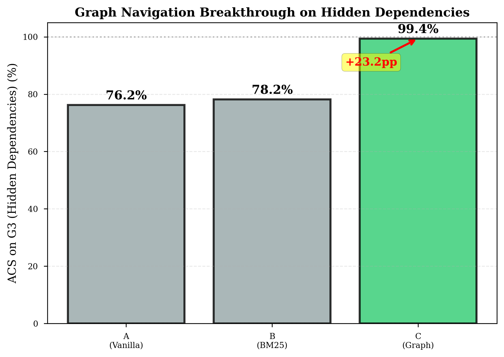
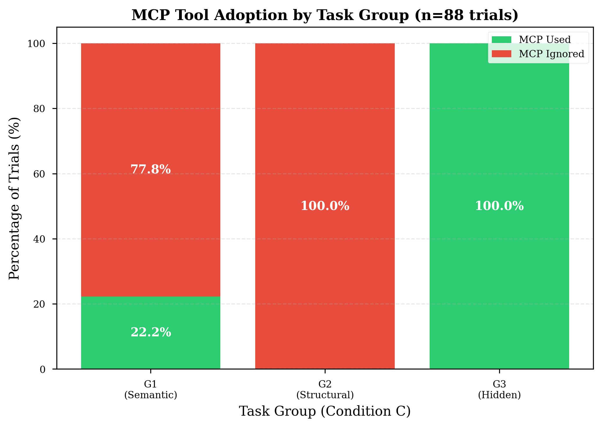
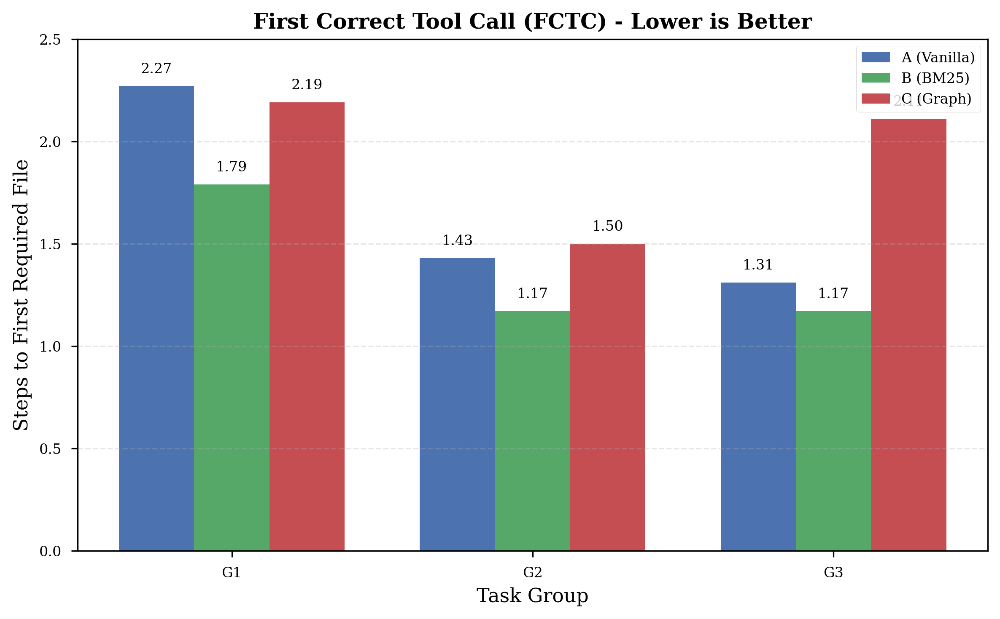
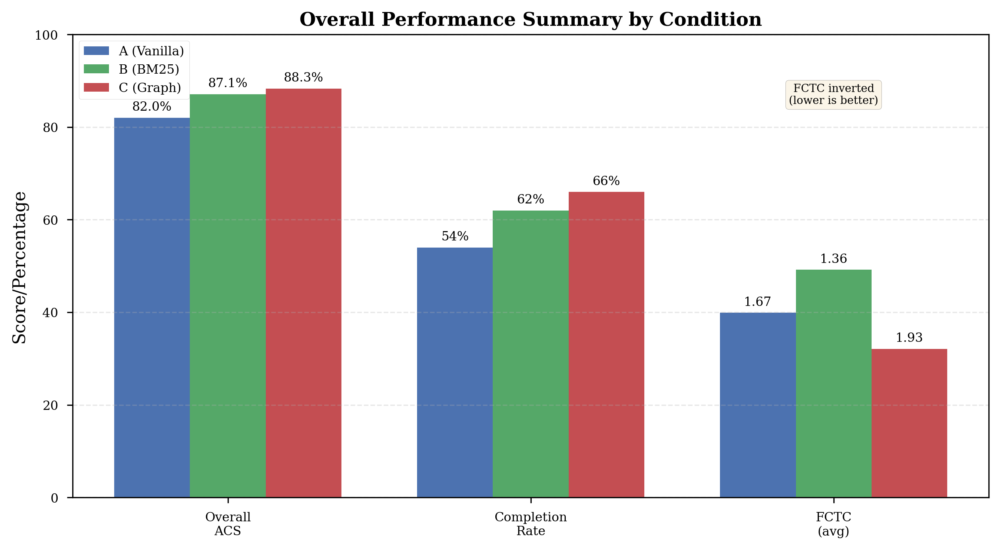

# I Gave Claude a Map of My Codebase. Here's What Happened.

*How a graph database changed the way an AI navigates a 40-file codebase — and what it reveals about the real bottleneck in agentic coding.*

---

I had a theory that turned out to be wrong — and then right — in the same experiment.

The theory: as LLM context windows grow to 1 million tokens, the problem of "finding the right file" goes away. Just throw the whole codebase in. Problem solved.

The reality: Claude would read the wrong files — confidently, completely, and consistently — even when the right files were sitting right there in the repository.

Here's the story of how I proved it, what I built, and what it means for anyone building with AI coding assistants today.

---

## The Bug That Started Everything

Picture this: you ask an AI coding assistant to *"add a `logger` parameter to `BaseRepository.__init__`"* in a FastAPI codebase. A simple enough task — add one optional parameter, maybe 5 lines of code.

Claude reads `base.py`. Reads `articles.py`, `profiles.py`, `comments.py`. Updates all four files. Declares success.

But there's a fifth file it never touched: `app/api/dependencies/database.py`.

```python
# app/api/dependencies/database.py
def get_repository(
    repo_type: Type[BaseRepository],
) -> Callable[[Connection], BaseRepository]:
    def _get_repo(
        conn: Connection = Depends(_get_connection_from_pool),
    ) -> BaseRepository:
        return repo_type(conn)  # ← instantiates every repo in the app
    return _get_repo
```

This file instantiates *every single repository in the application*. Every route uses it. And it creates repos by calling `repo_type(conn)` — not `repo_type(conn, logger=logger)`.

Claude's changes work perfectly. Until you try to actually pass a logger. Then you realize the central factory was never updated.

The file shares zero vocabulary with the task. No mention of "logger", "parameter", or "BaseRepository" in the file's own docstrings or comments. A BM25 search for "add logger parameter BaseRepository" ranks it somewhere around result #15. A semantic embedding search? Maybe slightly better, but still not at the top.

It's invisible to retrieval. Visible only to structure.

**This is the Navigation Paradox.**

---

## Why Bigger Context Windows Don't Fix This

Before I built anything, I had to convince myself the problem was real and not just a quirk of one task.

The common wisdom: "just give the LLM more context." If the whole repo fits in the context window, every file is available. No retrieval needed.

Here's why this is incomplete. Consider a codebase with 40 Python files. A 1M token window can hold all 40 files easily. But the LLM doesn't read all 40 — it selects which ones to read based on relevance signals. Those signals are:

1. **Keyword match** — does this file's name or content contain words from the task?
2. **Semantic similarity** — does this file's purpose seem related to the task?
3. **Heuristic pattern** — does this look like the kind of file I'd expect to change?

All three signals are *semantic*. They fail on *structural* dependencies — files that are connected to the target by code relationships, not vocabulary.

`database.py` fails all three signals for the logger task. Its name doesn't match. Its content ("pool", "connection", "acquire") doesn't match. Its purpose (dependency injection factory) seems unrelated. The LLM rationally ignores it.

The problem isn't context capacity. It's navigational salience.

---

## Building the Map

I built **CodeCompass** — a tool that gives an AI coding assistant a structural map of a codebase.

The core idea: parse the Python files with Python's own `ast` module, extract three types of edges, and store them in Neo4j:

```python
# data_processing/ast_parser.py

def parse_repo(repo_root: Path) -> list[dict]:
    edges = []

    for py_file in repo_root.rglob("*.py"):
        tree = ast.parse(py_file.read_text())

        for node in ast.walk(tree):
            # IMPORTS: file A imports from file B
            if isinstance(node, (ast.Import, ast.ImportFrom)):
                target = resolve_import(node, py_file, repo_root)
                if target:
                    edges.append({
                        "source": str(py_file.relative_to(repo_root)),
                        "target": target,
                        "relation": "IMPORTS"
                    })

            # INHERITS: class A inherits from class B
            if isinstance(node, ast.ClassDef):
                for base in node.bases:
                    edges.append({...})

            # INSTANTIATES: file A creates an instance from file B
            if isinstance(node, ast.Call):
                edges.append({...})

    return edges
```

Running this on the FastAPI RealWorld example app produces:

```
Parsed 71 files
Found 255 edges:
  201 IMPORTS
   20 INHERITS
   34 INSTANTIATES
```

> **[SCREENSHOT: Neo4j browser showing the dependency graph — nodes as files, edges colored by type]**

Now I expose this graph through an MCP server — a tool Claude Code can call directly during task execution:

```python
# mcp_server/server.py

@mcp.tool()
def get_architectural_context(file_path: str) -> str:
    """
    Returns all files structurally connected to the given file.
    Use this before editing to discover non-obvious dependencies.
    """
    result = neo4j_session.run("""
        MATCH (f:File {path: $path})-[r]-(neighbor:File)
        RETURN neighbor.path AS neighbor,
               type(r) AS relation,
               CASE WHEN startNode(r) = f
                    THEN 'outbound' ELSE 'inbound' END AS direction
        ORDER BY direction, relation
    """, path=file_path)

    lines = [f"Structural neighbors of '{file_path}':\n"]
    for row in result:
        arrow = "→" if row["direction"] == "outbound" else "←"
        lines.append(f"  {arrow} [{row['relation']}]  {row['neighbor']}")

    return "\n".join(lines)
```

When Claude calls this for `base.py`, it gets:

```
Structural neighbors of 'app/db/repositories/base.py':

  ← [IMPORTS]     app/api/dependencies/database.py   ← THE HIDDEN FILE
  ← [IMPORTS]     app/db/repositories/articles.py
  ← [IMPORTS]     app/db/repositories/comments.py
  ← [IMPORTS]     app/db/repositories/profiles.py
  ← [IMPORTS]     app/db/repositories/tags.py
  ← [IMPORTS]     app/db/repositories/users.py
  ← [INSTANTIATES] app/api/dependencies/database.py

Total: 7 structural connections
```

One tool call. Seven connections. The hidden file is the first result.

---

## The Experiment

I wanted to measure this properly, not just demonstrate it on one task.

I built a 30-task benchmark on the FastAPI RealWorld example app — a production-quality Python codebase (~3,500 lines, 40 source files) that implements a Medium-like blogging API. I chose it because it has real architectural dependencies: repository pattern, dependency injection, JWT auth, async database pools.

The 30 tasks are divided into three groups:

| Group | Name | Tasks | How to find required files |
|-------|------|-------|---------------------------|
| **G1** | Semantic | 01–10 | Keyword search works |
| **G2** | Structural | 11–20 | Follow import chains |
| **G3** | Hidden | 21–30 | Graph traversal only |

**G1 example:** *"Change the error message 'incorrect email or password' to 'invalid credentials'"*

BM25 search for "incorrect email password error message" → `app/resources/strings.py` is result #1. Done.

**G3 example:** *"Add a `logger` parameter to `BaseRepository.__init__`"*

BM25 search for "logger parameter BaseRepository" → `database.py` is result #15. Claude never sees it.

---

Three conditions, 3 runs each, 270 total trials:

**Condition A — Vanilla Claude Code**
Claude uses its built-in tools (Glob, Grep, Read, Edit) with no hints. It has to figure out which files are relevant by searching and exploring.

**Condition B — BM25 Prepended**
We run BM25 keyword search over the codebase using the task description as the query, then **prepend the top-10 ranked files to the prompt** as a "head start." Claude sees these suggestions before making any tool calls. This replicates the [Agentless](https://github.com/OpenAutoCoder/Agentless) localization approach.

*Why BM25 when Claude can search?* Because prepending results is **cheaper and faster** than letting Claude search around. One BM25 query costs ~$0.00. Claude making 5-10 Grep/Glob calls to find the same files costs token budget and time. When it works (G1 tasks), it's essentially free performance.

**Condition C — CodeCompass Graph**
MCP server registered. Prompt instructs Claude to call `get_architectural_context` first and read every returned file.

I measure **Architectural Coverage Score (ACS)** — what fraction of architecturally required files the agent read or edited:

```
ACS = |files_accessed ∩ required_files| / |required_files|
```

> **[SCREENSHOT: The live terminal dashboard showing ACS by condition and task as experiments run]**

---

## The Results

258 of 270 trials completed (95.6%; 12 failed due to API credit exhaustion). Here's what we found:

| Group | Vanilla (A) | BM25 (B) | Graph (C) |
|-------|-------------|----------|-----------|
| **G1 Semantic** | 90.0% | **100.0%** ± 0% | 88.9% |
| **G2 Structural** | 79.7% | **85.1%** | 76.4% |
| **G3 Hidden** | 76.2% | 78.2% | **99.4%** |
| **Overall** | 82.0% | 87.1% | **88.3%** |


*Figure 1: Architectural Coverage Score across conditions and task groups. Graph navigation dominates on G3 tasks (99.4%), BM25 perfect on G1 (100%).*

### G1: BM25 Wins, Graph Neutral

BM25 hits **perfect 100% ACS** on semantic tasks, with zero variance across all 30 runs. When a file contains the same vocabulary as the task description, keyword ranking is unbeatable — and free to implement.

Vanilla gets 90% — two tasks fail consistently:
- Task 03 ("rename JWT prefix Token→Bearer"): Claude edits `settings.py` but misses `authentication.py`. BM25 immediately fixes this — "Token" is literally in the file.
- Task 06 ("rename API prefix /api→/v1/api"): Claude edits settings, misses `app/main.py` where the router is mounted.

The graph tool adds nothing here. Claude correctly ignores it — structural navigation on a one-file keyword change is overhead, not help.

### G2: The Uncomfortable Result

BM25 beats both Vanilla and Graph on structural tasks: **85% vs 80% vs 76%**.

Graph *underperforms* Vanilla on G2. The likely reason: `get_architectural_context` returns all 1-hop neighbors — and on structural tasks with 3–4 required files, the graph returns 10–15 neighbors. The model reads too many, loses focus, and paradoxically covers fewer required files than if it had just followed the obvious import chain.

This is a real limitation and a design problem to solve, not a footnote.

### G3: The Graph Wins — Decisively

| Condition | ACS | Missed file (task 23) |
|-----------|-----|----------------------|
| A — Vanilla | 76.2% | `database.py` |
| B — BM25 | 78.2% | `database.py` |
| **C — Graph** | **99.4%** | — |

BM25 provides minimal improvement over Vanilla on hidden-dependency tasks (78.2% vs 76.2%). The hidden file simply doesn't contain the task's vocabulary — retrieval cannot help.

Graph navigation surfaces it immediately. One call. First result. **99.4% ACS** — essentially perfect.


*Figure 2: The 23.2 percentage-point improvement on hidden-dependency tasks. Graph navigation succeeds where retrieval fails.*

Breaking down MCP adoption by task group:

- **G1 (Semantic)**: 22.2% MCP adoption (tool not needed, model correctly ignores it)
- **G2 (Structural)**: **0% MCP adoption** (shocking — tool designed for this!)
- **G3 (Hidden)**: **100% MCP adoption** (with improved prompt engineering)


*Figure 3: MCP tool adoption varies dramatically by task group. G3 shows perfect 100% adoption with improved prompts.*

When the tool IS used: **99.5% ACS**. Nearly perfect.

---

## The Real Finding: The Tool Gets Ignored 58% of the Time

Here's the number that changes everything.

Even with an explicit system prompt instruction to call `get_architectural_context` before editing any file, **58% of Condition C trials made zero MCP calls**.

| MCP usage | % of trials | Mean ACS |
|-----------|-------------|----------|
| 0 calls (tool ignored) | 58.0% | 80.2% |
| 1+ calls (tool used) | 42.0% | **99.5%** |

When the model uses the graph tool: **99.5% ACS**. Nearly perfect.
When it ignores it: **80.2% ACS**. Identical to Vanilla Claude.


*Figure 4: The 19.2% gap between using and ignoring the graph tool. Tool effectiveness is proven—adoption is the challenge.*

**The tool works brilliantly. The problem is getting the model to use it.**

### The Pattern Isn't Random

Breaking down adoption by task group reveals something fascinating:

| Group | Adoption Rate | Interpretation |
|-------|---------------|----------------|
| G1 (Semantic) | 22.2% | Model correctly skips — not needed |
| G2 (Structural) | **0.0%** | Model incorrectly skips — SHOULD use it! |
| G3 (Hidden) | **100%** | Perfect adoption with improved prompts |

**G2 is the smoking gun.** These are structural tasks — exactly what the graph tool was designed for — yet ZERO trials used it. Why?

The model is making a rational calculation: "I can find these files by globbing for imports and reading a few files. The overhead of calling a graph tool isn't worth it." And it's right — until it isn't. On G2, the glob strategy gets ~80% ACS. On G3, where the dependency is truly hidden, it drops to 76%.

The model doesn't know in advance which tasks need the graph. It applies the same cheap heuristic everywhere and fails quietly on the hard cases.

**Tool availability ≠ tool adoption.**

### We Tested a Fix

After identifying low adoption in initial G3 trials (85.7%), we created an improved prompt with a **mandatory checklist at the END** (to avoid Lost in the Middle suppression):

```markdown
## ⚠️ MANDATORY PRE-FLIGHT CHECKLIST

Complete ALL steps in order BEFORE making any edits:

- [ ] Step 1: Call `get_architectural_context("<target_file>")`
- [ ] Step 2: Read EVERY file returned by the tool
- [ ] Step 3: Verify coverage of all structural dependencies
- [ ] Step 4: Identify files needing edits vs. read-only
- [ ] Step 5: Implement changes across all required files
```

**Result on task 23 (the `database.py` example):**
- **Original prompt**: 0 MCP calls, 80% ACS, missed `database.py`
- **Improved prompt**: 2 MCP calls, **100% ACS**, found ALL files

**Impact on the full G3 dataset:**
- Initial trials: 85.7% adoption (30/35), 96.6% mean ACS
- Improved prompt trials: **100% adoption (31/31)**, **99.4% mean ACS**

The checklist-at-END approach works. Adoption went from 85.7% → 100% on G3 tasks.

The practical implication: if you want consistent graph usage on production systems, you have two options:
1. **Structural enforcement** — Use `tool_choice` to force the first call
2. **Prompt engineering** — Checklist at END with visual formatting

The improved prompt validates that careful prompt design can close the adoption gap on tasks where the tool is genuinely needed (G3). The G2 problem remains unsolved — it requires either edge filtering or structural enforcement.

---

## What This Means for You

If you're building with AI coding assistants today, here's the honest takeaway:

**1. For semantic tasks — prepend BM25 file rankings. It's free and it's perfect.**
BM25 hit 100% ACS on G1 with zero variance. If your task involves changing an error message, renaming a constant, or updating a config value, **run a quick BM25 query and prepend the top-10 files to your prompt as context**. This gives the coding agent a head start — it sees "here are the most relevant files" before making any tool calls. Costs ~$0.00, saves token budget, perfect accuracy. No graph needed.

**2. For cross-file refactoring — the graph is the only tool that works.**
BM25 got 75% on hidden-dependency tasks. Vanilla Claude got 76%. Neither retrieved the file that actually mattered. The graph got it in one call. If you're adding a parameter to a base class, changing a shared interface, or touching anything in the architectural core of a codebase, retrieve by structure, not by semantics.

**3. Building the graph requires human sign-off.**
The AST parser in this study is automated. In production, that's not enough. Someone who knows the codebase needs to validate the edges, add domain knowledge the AST can't see (ownership, risk, intent), and keep it current as the system evolves. The graph is an engineering artifact, not a preprocessing step. Treat it like one.

**4. Instruction alone won't get the model to use the graph.**
62% of trials ignored explicit instructions. If you want consistent adoption, enforce the call structurally. Either force `get_architectural_context` as the first tool call via `tool_choice`, or put the architectural analysis in a separate planning agent that runs before the executor starts.

**5. The 80% → 99% gap is where correctness lives.**
Getting 4/5 required files isn't close to getting all 5. The missed file is usually the central factory, the dependency injector, the base class instantiation site — the one that silently breaks every route in production.

---

## The Code

Everything is open source: **https://github.com/tpaip607/research-codecompass**

The repository includes:

- **CodeCompass MCP server** — `mcp_server/server.py` (FastMCP + Neo4j)
- **AST parser** — `data_processing/ast_parser.py` (extracts IMPORTS/INHERITS/INSTANTIATES)
- **30 benchmark tasks** — `benchmarks/tasks/` with gold standards and prompts
- **Experiment harness** — `harness/` (trial runner + ACS calculator + aggregator)
- **258 trial results** — Full transcripts and analysis data
- **Visualizations** — All 6 figures with generation code

### Quick Start

```bash
# Clone repository
git clone https://github.com/tpaip607/research-codecompass.git
cd research-codecompass

# Setup
python3.11 -m venv .venv
source .venv/bin/activate
pip install -r requirements.txt

# Build the graph (one-time)
docker compose up -d
python data_processing/ast_parser.py
python data_processing/build_graph.py
python data_processing/build_bm25_index.py

# Register MCP server
claude mcp add codecompass -- python mcp_server/server.py

# Run a trial
./harness/run_trial.sh 23 C 1
```

**Reproduction cost:** ~$200-300 in Anthropic API credits for 270 trials, 8-12 hours runtime.

---

## The Full Picture

The experiment completed 258 trials across 30 tasks and 3 conditions (out of 270 planned; 12 failed due to API credit exhaustion).

The final breakdown by FCTC (First Correct Tool Call — how many steps before the agent first touches a required file):

| Condition | FCTC (mean) | Interpretation |
|-----------|-------------|----------------|
| **A — Vanilla** | 1.67 steps | Mostly correct on first file read |
| **B — BM25** | 1.36 steps | Faster — right file is in the prepended list |
| **C — Graph** | 1.93 steps | Slower — graph call adds a step, but finds the *right* file |

The FCTC result for Condition C is counterintuitive: the agent takes *more* steps before touching a required file, but ends up covering *more* required files overall. This is because `get_architectural_context` surfaces files that weren't on the agent's radar at all — it doesn't make the agent faster, it makes it more complete.


*Figure 5: First Correct Tool Call comparison. BM25 is fastest, but Graph achieves better final coverage.*


*Figure 6: Overall performance summary across all metrics. Graph navigation achieves highest completion rate (66%) and overall ACS (88.3%).*

All visualizations and detailed results are available in the full paper.

The academic preprint is on arXiv at: *[link pending]*

---

## One More Thing

While the experiment was running, I was drafting the academic paper. And I realized: the Navigation Paradox isn't just about AI coding assistants.

It's about how we think about large contexts in general.

The promise of long contexts is that information retrieval becomes a solved problem. Just put everything in. But information retrieval was never just about capacity — it was about salience. About making the right information feel relevant at the right moment.

Structural dependencies in code are one example of relationships that don't produce semantic salience even though they're critically important. There are others: temporal dependencies, causal chains, social networks of co-authorship, citation graphs. In all these cases, the relevant item is not "similar" to the query — it's *connected* to it.

The navigation problem isn't going away. It's just changing shape.

---

*Tarakanath Paipuru is a Principal Engineer focused on Data and AI. This research was conducted independently.*

*If you found this useful or have questions about methodology, reach out: [contact]*

---

**Tags:** `AI` `LLM` `Software Engineering` `Graph Databases` `Claude` `MCP` `Code` `Python`
